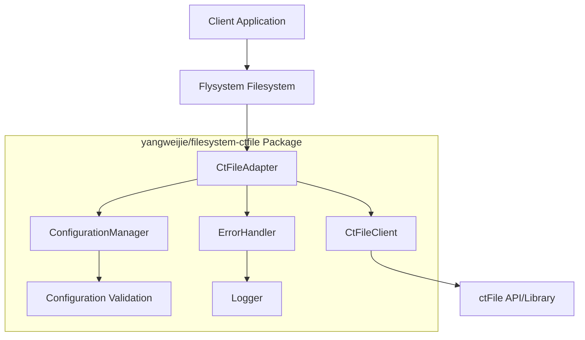
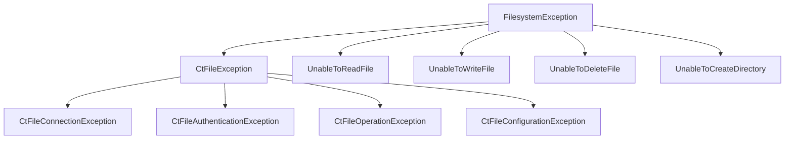

# Design Document

## Overview

The `yangweijie/filesystem-ctfile` package is designed as a PHP filesystem extension that bridges ctFile functionality with the Flysystem ecosystem. The package implements a custom Flysystem adapter that provides enhanced file management capabilities while maintaining full compatibility with the Flysystem interface. This design ensures seamless integration with existing Flysystem-based applications while extending functionality through ctFile integration.

The architecture follows the adapter pattern, allowing the package to act as a translator between Flysystem's standardized interface and ctFile's specific implementation. This approach provides flexibility, maintainability, and extensibility while adhering to established PHP and Flysystem conventions.

## Architecture

### High-Level Architecture



### Layer Architecture

1. **Presentation Layer**: Flysystem interface compliance
2. **Business Logic Layer**: Adapter implementation and ctFile integration
3. **Data Access Layer**: ctFile client and configuration management
4. **Infrastructure Layer**: Error handling, logging, and utilities

### Design Patterns

- **Adapter Pattern**: Main pattern for Flysystem integration
- **Factory Pattern**: For creating configured instances
- **Strategy Pattern**: For different storage backend implementations
- **Decorator Pattern**: For adding logging and error handling capabilities

## Components and Interfaces

### Core Components

#### 1. CtFileAdapter

**Purpose**: Main adapter class implementing Flysystem's FilesystemAdapter interface

**Key Responsibilities**:
- Implement all required Flysystem adapter methods
- Translate Flysystem operations to ctFile operations
- Handle path normalization and validation
- Manage file metadata and attributes

**Interface**:
```php
class CtFileAdapter implements FilesystemAdapter
{
    public function __construct(CtFileClient $client, array $config = []);
    public function fileExists(string $path): bool;
    public function directoryExists(string $path): bool;
    public function write(string $path, string $contents, Config $config): void;
    public function writeStream(string $path, $contents, Config $config): void;
    public function read(string $path): string;
    public function readStream(string $path);
    public function delete(string $path): void;
    public function deleteDirectory(string $path): void;
    public function createDirectory(string $path, Config $config): void;
    public function setVisibility(string $path, string $visibility): void;
    public function visibility(string $path): FileAttributes;
    public function mimeType(string $path): FileAttributes;
    public function lastModified(string $path): FileAttributes;
    public function fileSize(string $path): FileAttributes;
    public function listContents(string $path, bool $deep): iterable;
    public function move(string $source, string $destination, Config $config): void;
    public function copy(string $source, string $destination, Config $config): void;
}
```

#### 2. CtFileClient

**Purpose**: Wrapper for ctFile functionality and API interactions

**Key Responsibilities**:
- Encapsulate ctFile-specific operations
- Handle ctFile authentication and connection management
- Provide abstraction layer for ctFile features
- Manage ctFile-specific configurations

**Interface**:
```php
class CtFileClient
{
    public function __construct(array $config);
    public function connect(): bool;
    public function disconnect(): void;
    public function uploadFile(string $localPath, string $remotePath): bool;
    public function downloadFile(string $remotePath, string $localPath): bool;
    public function deleteFile(string $path): bool;
    public function listFiles(string $directory): array;
    public function getFileInfo(string $path): array;
    public function createDirectory(string $path): bool;
    public function removeDirectory(string $path): bool;
    public function fileExists(string $path): bool;
    public function directoryExists(string $path): bool;
}
```

#### 3. ConfigurationManager

**Purpose**: Handle configuration validation and management

**Key Responsibilities**:
- Validate configuration parameters
- Provide default configuration values
- Manage environment-specific settings
- Handle configuration merging and inheritance

**Interface**:
```php
class ConfigurationManager
{
    public function __construct(array $config = []);
    public function validate(): bool;
    public function get(string $key, $default = null);
    public function set(string $key, $value): void;
    public function merge(array $config): void;
    public function toArray(): array;
    public static function getDefaultConfig(): array;
}
```

#### 4. ErrorHandler

**Purpose**: Centralized error handling and exception management

**Key Responsibilities**:
- Convert ctFile errors to Flysystem exceptions
- Provide detailed error context and debugging information
- Handle different error types appropriately
- Integrate with logging system

**Interface**:
```php
class ErrorHandler
{
    public function __construct(LoggerInterface $logger = null);
    public function handleCtFileError(\Throwable $error, string $operation, string $path = ''): void;
    public function createFlysystemException(string $type, string $message, string $path = ''): \Throwable;
    public function logError(\Throwable $error, array $context = []): void;
}
```

### Supporting Components

#### 5. PathNormalizer

**Purpose**: Handle path normalization and validation

**Interface**:
```php
class PathNormalizer
{
    public static function normalize(string $path): string;
    public static function validate(string $path): bool;
    public static function isAbsolute(string $path): bool;
    public static function join(string ...$parts): string;
}
```

#### 6. MetadataMapper

**Purpose**: Map between ctFile metadata and Flysystem FileAttributes

**Interface**:
```php
class MetadataMapper
{
    public static function toFileAttributes(array $ctFileMetadata): FileAttributes;
    public static function toDirectoryAttributes(array $ctFileMetadata): FileAttributes;
    public static function extractMimeType(array $metadata): string;
    public static function extractVisibility(array $metadata): string;
}
```

## Data Models

### Configuration Schema

```php
[
    'ctfile' => [
        'host' => 'string|required',
        'port' => 'integer|default:21',
        'username' => 'string|required',
        'password' => 'string|required',
        'timeout' => 'integer|default:30',
        'ssl' => 'boolean|default:false',
        'passive' => 'boolean|default:true',
    ],
    'adapter' => [
        'root_path' => 'string|default:/',
        'path_separator' => 'string|default:/',
        'case_sensitive' => 'boolean|default:true',
        'create_directories' => 'boolean|default:true',
    ],
    'logging' => [
        'enabled' => 'boolean|default:false',
        'level' => 'string|default:info',
        'channel' => 'string|default:filesystem-ctfile',
    ],
    'cache' => [
        'enabled' => 'boolean|default:false',
        'ttl' => 'integer|default:300',
        'driver' => 'string|default:memory',
    ]
]
```

### FileAttributes Extensions

```php
class CtFileAttributes extends FileAttributes
{
    private array $ctFileMetadata;
    
    public function getCtFileMetadata(): array;
    public function getCtFileProperty(string $key, $default = null);
    public function hasCtFileProperty(string $key): bool;
}
```

## Error Handling

### Exception Hierarchy



### Error Handling Strategy

1. **Graceful Degradation**: Fallback to basic operations when ctFile features are unavailable
2. **Detailed Context**: Include operation context, file paths, and ctFile-specific error codes
3. **Logging Integration**: Log all errors with appropriate severity levels
4. **User-Friendly Messages**: Provide clear, actionable error messages for common issues

### Retry Mechanism

```php
class RetryHandler
{
    public function __construct(int $maxRetries = 3, int $delay = 1000);
    public function execute(callable $operation, array $retryableExceptions = []): mixed;
    public function shouldRetry(\Throwable $exception): bool;
}
```

## Testing Strategy

### Unit Testing

- **Adapter Methods**: Test all Flysystem adapter interface methods
- **Configuration**: Test configuration validation and error handling
- **Error Handling**: Test exception throwing and error message formatting
- **Path Normalization**: Test path handling edge cases
- **Metadata Mapping**: Test conversion between ctFile and Flysystem formats

### Integration Testing

- **Flysystem Compatibility**: Test with different Flysystem versions
- **ctFile Integration**: Test actual ctFile operations (with mock server)
- **End-to-End Workflows**: Test complete file operation workflows
- **Performance**: Test operation performance and memory usage

### Test Structure

```
tests/
├── Unit/
│   ├── CtFileAdapterTest.php
│   ├── CtFileClientTest.php
│   ├── ConfigurationManagerTest.php
│   ├── ErrorHandlerTest.php
│   └── PathNormalizerTest.php
├── Integration/
│   ├── FlysystemCompatibilityTest.php
│   ├── CtFileIntegrationTest.php
│   └── PerformanceTest.php
└── Fixtures/
    ├── MockCtFileServer.php
    └── TestConfiguration.php
```

### Testing Tools

- **PHPUnit**: Primary testing framework
- **Mockery**: For mocking dependencies
- **VFS Stream**: For virtual filesystem testing
- **PHPBench**: For performance benchmarking

## Performance Considerations

### Optimization Strategies

1. **Connection Pooling**: Reuse ctFile connections when possible
2. **Lazy Loading**: Initialize ctFile client only when needed
3. **Caching**: Cache file metadata and directory listings
4. **Batch Operations**: Group multiple operations when supported by ctFile
5. **Stream Processing**: Use streams for large file operations

### Memory Management

- Use generators for directory listings
- Implement proper resource cleanup
- Avoid loading large files entirely into memory
- Use temporary files for stream operations

### Monitoring

```php
class PerformanceMonitor
{
    public function startOperation(string $operation, string $path): string;
    public function endOperation(string $operationId): void;
    public function getMetrics(): array;
    public function reset(): void;
}
```

## Security Considerations

### Authentication

- Secure credential storage and handling
- Support for different authentication methods
- Connection encryption when available
- Credential validation and sanitization

### Path Security

- Path traversal prevention
- Input validation and sanitization
- Access control enforcement
- Safe path normalization

### Data Protection

- Secure temporary file handling
- Memory cleanup for sensitive data
- Logging sanitization (no credentials in logs)
- Error message sanitization

## Extensibility

### Plugin System

```php
interface CtFilePlugin
{
    public function getName(): string;
    public function initialize(CtFileAdapter $adapter): void;
    public function beforeOperation(string $operation, array $params): array;
    public function afterOperation(string $operation, $result): mixed;
}
```

### Custom Storage Backends

```php
interface StorageBackend
{
    public function connect(array $config): bool;
    public function disconnect(): void;
    public function supportsOperation(string $operation): bool;
    public function executeOperation(string $operation, array $params): mixed;
}
```

### Event System

```php
class EventDispatcher
{
    public function dispatch(string $eventName, array $data = []): void;
    public function listen(string $eventName, callable $listener): void;
    public function removeListener(string $eventName, callable $listener): void;
}
```

Events:
- `ctfile.connection.established`
- `ctfile.connection.failed`
- `ctfile.operation.started`
- `ctfile.operation.completed`
- `ctfile.operation.failed`
- `ctfile.file.uploaded`
- `ctfile.file.downloaded`
- `ctfile.directory.created`